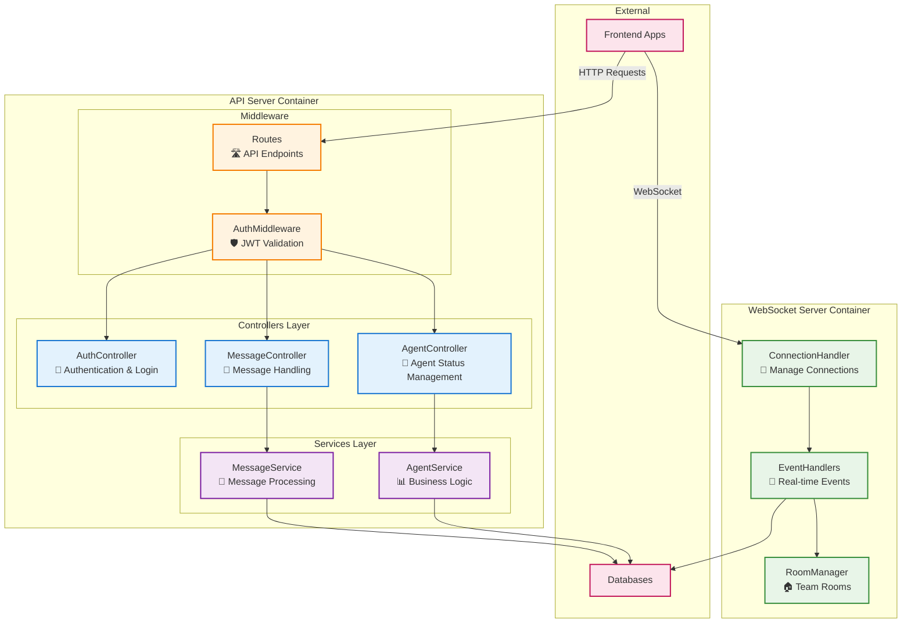
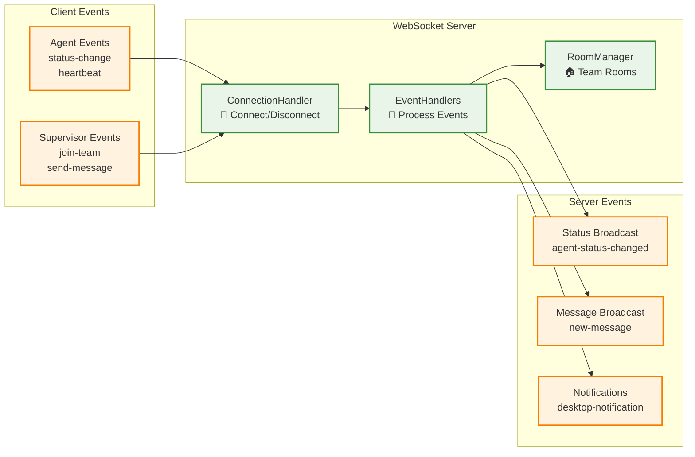

# Agent Wallboard System - C3 Backend Components
## Software Architecture - C4 Model Level 3 (Section 2)

**Document ID:** C3-AWS-BACKEND-001  
**Version:** 1.0  
**วันที่:** กันยายน 2025  
**จัดทำโดย:** อาจารย์ ENGSE206 - RMUTL  

---

## 🔧 Section 2: Backend Components 

### 2.1 Backend Architecture Overview



---

## 🔧 2.2 API Server Components

### 2.2.1 Controllers Layer (HTTP Request Handlers)

#### 🔐 **AuthController.js**
**Purpose:** จัดการการ login/logout และ authentication  
**Key Functions:**
- รับ login request และตรวจสอบ credentials
- สร้าง JWT token สำหรับ authenticated users
- จัดการ logout และ invalidate tokens

**Simple Code:**
```javascript
// AuthController.js
const jwt = require('jsonwebtoken');
const bcrypt = require('bcrypt');

class AuthController {
  async login(req, res) {
    try {
      const { agentCode, password } = req.body;
      
      // ตรวจสอบ user ใน database
      const user = await User.findOne({ agentCode });
      if (!user || !bcrypt.compareSync(password, user.password)) {
        return res.status(401).json({ error: 'Invalid credentials' });
      }
      
      // สร้าง JWT token
      const token = jwt.sign(
        { 
          userId: user.id, 
          agentCode: user.agentCode, 
          role: user.role 
        },
        process.env.JWT_SECRET,
        { expiresIn: '8h' }
      );
      
      res.json({
        token,
        user: {
          id: user.id,
          agentCode: user.agentCode,
          fullName: user.fullName,
          role: user.role,
          teamId: user.teamId
        }
      });
    } catch (error) {
      res.status(500).json({ error: 'Login failed' });
    }
  }

  async logout(req, res) {
    // Simple logout - ใน production จะเก็บ blacklist tokens
    res.json({ message: 'Logged out successfully' });
  }
}

module.exports = new AuthController();
```

**Dependencies:** User model, JWT library, bcrypt

---

#### 👤 **AgentController.js**
**Purpose:** จัดการ agent status และข้อมูล agent  
**Key Functions:**
- อัปเดตสถานะ agent (Available, Busy, Break, etc.)
- ดึงข้อมูล agent และประวัติสถานะ
- validate การเปลี่ยนสถานะตาม business rules

**Simple Code:**
```javascript
// AgentController.js
const AgentService = require('../services/AgentService');

class AgentController {
  async updateStatus(req, res) {
    try {
      const { id } = req.params;
      const { status, reason } = req.body;
      const userId = req.user.userId;
      
      // ตรวจสอบว่า agent สามารถเปลี่ยนสถานะได้หรือไม่
      if (id !== userId && req.user.role !== 'supervisor') {
        return res.status(403).json({ error: 'Access denied' });
      }
      
      // เรียกใช้ service เพื่อ update status
      const result = await AgentService.updateStatus(id, status, reason);
      
      res.json(result);
    } catch (error) {
      res.status(400).json({ error: error.message });
    }
  }
  
  async getAgentHistory(req, res) {
    try {
      const { id } = req.params;
      const history = await AgentService.getStatusHistory(id);
      
      res.json(history);
    } catch (error) {
      res.status(500).json({ error: 'Failed to get history' });
    }
  }
  
  async getTeamAgents(req, res) {
    try {
      const teamId = req.user.teamId;
      const agents = await AgentService.getTeamAgents(teamId);
      
      res.json(agents);
    } catch (error) {
      res.status(500).json({ error: 'Failed to get team agents' });
    }
  }
}

module.exports = new AgentController();
```

**Dependencies:** AgentService, Authentication middleware

---

#### 💬 **MessageController.js**
**Purpose:** จัดการการส่งและรับข้อความ  
**Key Functions:**
- ส่งข้อความ direct ถึง agent เฉพาะคน
- ส่งข้อความ broadcast ถึงทั้งทีม
- ดึงข้อความใน inbox ของ agent

**Simple Code:**
```javascript
// MessageController.js
const MessageService = require('../services/MessageService');

class MessageController {
  async sendMessage(req, res) {
    try {
      const { recipientId, content, type, priority } = req.body;
      const senderId = req.user.userId;
      
      // ตรวจสอบสิทธิ์ในการส่งข้อความ
      if (req.user.role === 'agent') {
        return res.status(403).json({ error: 'Agents cannot send messages' });
      }
      
      // ส่งข้อความผ่าน service
      const message = await MessageService.sendMessage({
        senderId,
        recipientId,
        content,
        type,
        priority
      });
      
      res.json(message);
    } catch (error) {
      res.status(400).json({ error: error.message });
    }
  }
  
  async getInbox(req, res) {
    try {
      const { userId } = req.params;
      
      // ตรวจสอบว่าดูได้เฉพาะ inbox ของตัวเอง
      if (userId !== req.user.userId && req.user.role !== 'supervisor') {
        return res.status(403).json({ error: 'Access denied' });
      }
      
      const messages = await MessageService.getInbox(userId);
      res.json(messages);
    } catch (error) {
      res.status(500).json({ error: 'Failed to get messages' });
    }
  }
  
  async markAsRead(req, res) {
    try {
      const { id } = req.params;
      
      await MessageService.markAsRead(id, req.user.userId);
      res.json({ success: true });
    } catch (error) {
      res.status(400).json({ error: error.message });
    }
  }
}

module.exports = new MessageController();
```

**Dependencies:** MessageService, Authentication middleware

---

### 2.2.2 Services Layer (Business Logic)

#### 📊 **AgentService.js**
**Purpose:** ประมวลผล business logic สำหรับ agent operations  
**Key Functions:**
- validate status transitions ตาม business rules
- บันทึกประวัติการเปลี่ยนสถานะ
- คำนวณสถิติและ performance metrics

**Simple Code:**
```javascript
// AgentService.js
const { AgentStatus, User } = require('../models');

class AgentService {
  async updateStatus(agentId, newStatus, reason = '') {
    // Business Rules Validation
    const validStatuses = ['Available', 'Busy', 'Break', 'Meeting', 'Offline'];
    if (!validStatuses.includes(newStatus)) {
      throw new Error('Invalid status');
    }
    
    // ตรวจสอบ Break time limit (2 ชั่วโมง/วัน)
    if (newStatus === 'Break') {
      const todayBreakTime = await this.getTodayBreakTime(agentId);
      if (todayBreakTime >= 7200) { // 2 hours in seconds
        throw new Error('Break time limit exceeded (2 hours/day)');
      }
    }
    
    // บันทึกสถานะใหม่ลง MongoDB
    const statusRecord = await AgentStatus.create({
      agentId,
      status: newStatus,
      reason,
      timestamp: new Date(),
      previousStatus: await this.getCurrentStatus(agentId)
    });
    
    // อัปเดต current status ใน SQL Server
    await User.update(
      { currentStatus: newStatus, lastStatusChange: new Date() },
      { where: { id: agentId } }
    );
    
    return statusRecord;
  }
  
  async getStatusHistory(agentId, days = 7) {
    const fromDate = new Date();
    fromDate.setDate(fromDate.getDate() - days);
    
    return await AgentStatus.find({
      agentId,
      timestamp: { $gte: fromDate }
    }).sort({ timestamp: -1 });
  }
  
  async getTeamAgents(teamId) {
    return await User.findAll({
      where: { teamId, role: 'agent' },
      attributes: ['id', 'agentCode', 'fullName', 'currentStatus', 'lastStatusChange']
    });
  }
  
  async getTodayBreakTime(agentId) {
    const today = new Date();
    today.setHours(0, 0, 0, 0);
    
    const breakSessions = await AgentStatus.find({
      agentId,
      status: 'Break',
      timestamp: { $gte: today }
    });
    
    // คำนวณเวลา break รวม (simplified calculation)
    return breakSessions.length * 900; // assume 15 min per break
  }
  
  async getCurrentStatus(agentId) {
    const latestStatus = await AgentStatus.findOne({
      agentId
    }).sort({ timestamp: -1 });
    
    return latestStatus ? latestStatus.status : 'Offline';
  }
}

module.exports = new AgentService();
```

**Dependencies:** AgentStatus model (MongoDB), User model (SQL Server)

---

#### 📨 **MessageService.js**
**Purpose:** ประมวลผล business logic สำหรับ messaging system  
**Key Functions:**
- validate message content และ recipients
- จัดการ broadcast messages ถึงทั้งทีม
- track message delivery status

**Simple Code:**
```javascript
// MessageService.js
const { Message, User } = require('../models');

class MessageService {
  async sendMessage({ senderId, recipientId, content, type, priority }) {
    // Validate message content
    if (!content || content.trim().length === 0) {
      throw new Error('Message content is required');
    }
    
    if (content.length > 500) {
      throw new Error('Message too long (max 500 characters)');
    }
    
    // สร้างข้อความใน MongoDB
    const message = await Message.create({
      senderId,
      recipientId: type === 'broadcast' ? null : recipientId,
      content: content.trim(),
      type,
      priority: priority || 'normal',
      sentAt: new Date(),
      isRead: false
    });
    
    // ถ้าเป็น broadcast ต้องสร้างข้อความให้ทุกคนในทีม
    if (type === 'broadcast') {
      await this.createBroadcastMessages(message, senderId);
    }
    
    return message;
  }
  
  async createBroadcastMessages(originalMessage, senderId) {
    // หา team ของ sender
    const sender = await User.findByPk(senderId);
    const teamAgents = await User.findAll({
      where: { teamId: sender.teamId, role: 'agent' },
      attributes: ['id']
    });
    
    // สร้างข้อความสำหรับแต่ละ agent
    const broadcastMessages = teamAgents.map(agent => ({
      ...originalMessage.toObject(),
      recipientId: agent.id,
      originalMessageId: originalMessage._id
    }));
    
    await Message.insertMany(broadcastMessages);
  }
  
  async getInbox(userId, limit = 50) {
    return await Message.find({
      recipientId: userId
    })
    .sort({ sentAt: -1 })
    .limit(limit)
    .populate('senderId', 'fullName agentCode');
  }
  
  async markAsRead(messageId, userId) {
    const result = await Message.updateOne(
      { _id: messageId, recipientId: userId },
      { isRead: true, readAt: new Date() }
    );
    
    if (result.modifiedCount === 0) {
      throw new Error('Message not found or access denied');
    }
    
    return result;
  }
  
  async getUnreadCount(userId) {
    return await Message.countDocuments({
      recipientId: userId,
      isRead: false
    });
  }
}

module.exports = new MessageService();
```

**Dependencies:** Message model (MongoDB), User model (SQL Server)

---

### 2.2.3 Middleware Components

#### 🛡️ **AuthMiddleware.js**
**Purpose:** ตรวจสอบ JWT token และ user authorization  
**Key Functions:**
- ตรวจสอบ JWT token ใน request headers
- validate token และแปลงเป็น user object
- ป้องกัน unauthorized access

**Simple Code:**
```javascript
// AuthMiddleware.js
const jwt = require('jsonwebtoken');

const authMiddleware = (req, res, next) => {
  try {
    // ดึง token จาก Authorization header
    const authHeader = req.headers.authorization;
    if (!authHeader || !authHeader.startsWith('Bearer ')) {
      return res.status(401).json({ error: 'No token provided' });
    }
    
    const token = authHeader.substring(7); // Remove 'Bearer ' prefix
    
    // ตรวจสอบและ decode token
    const decoded = jwt.verify(token, process.env.JWT_SECRET);
    
    // เก็บ user info ใน request object
    req.user = {
      userId: decoded.userId,
      agentCode: decoded.agentCode,
      role: decoded.role
    };
    
    next();
  } catch (error) {
    if (error.name === 'TokenExpiredError') {
      return res.status(401).json({ error: 'Token expired' });
    }
    return res.status(401).json({ error: 'Invalid token' });
  }
};

// Role-based authorization middleware
const requireRole = (roles) => {
  return (req, res, next) => {
    if (!req.user) {
      return res.status(401).json({ error: 'Authentication required' });
    }
    
    if (!roles.includes(req.user.role)) {
      return res.status(403).json({ error: 'Insufficient permissions' });
    }
    
    next();
  };
};

module.exports = { authMiddleware, requireRole };
```

**Dependencies:** jsonwebtoken library

---

#### 🛣️ **Routes.js**
**Purpose:** กำหนด API endpoints และเชื่อมต่อกับ controllers  
**Key Functions:**
- define URL routes สำหรับแต่ละ API endpoint
- apply middleware สำหรับ authentication และ authorization
- organize routes by functionality

**Simple Code:**
```javascript
// routes.js
const express = require('express');
const router = express.Router();

const AuthController = require('./controllers/AuthController');
const AgentController = require('./controllers/AgentController');
const MessageController = require('./controllers/MessageController');
const { authMiddleware, requireRole } = require('./middleware/AuthMiddleware');

// Authentication routes (no auth required)
router.post('/auth/login', AuthController.login);
router.post('/auth/logout', authMiddleware, AuthController.logout);

// Agent routes (auth required)
router.put('/agents/:id/status', authMiddleware, AgentController.updateStatus);
router.get('/agents/:id/history', authMiddleware, AgentController.getAgentHistory);
router.get('/teams/agents', authMiddleware, requireRole(['supervisor', 'admin']), AgentController.getTeamAgents);

// Message routes (auth required)
router.post('/messages/send', authMiddleware, requireRole(['supervisor', 'admin']), MessageController.sendMessage);
router.get('/messages/inbox/:userId', authMiddleware, MessageController.getInbox);
router.put('/messages/:id/read', authMiddleware, MessageController.markAsRead);

// Health check (no auth required)
router.get('/health', (req, res) => {
  res.json({ status: 'OK', timestamp: new Date().toISOString() });
});

module.exports = router;
```

**Dependencies:** Express router, Controllers, Middleware

---

## ⚡ 2.3 WebSocket Server Components

### 2.3.1 WebSocket Architecture Overview



### 2.3.2 WebSocket Components Detail

#### 🔌 **ConnectionHandler.js**
**Purpose:** จัดการ WebSocket connections และ authentication  
**Key Functions:**
- ตรวจสอบ JWT token เมื่อ client connect
- จัดการ connect/disconnect events
- maintain active connections list

**Simple Code:**
```javascript
// ConnectionHandler.js
const jwt = require('jsonwebtoken');

class ConnectionHandler {
  constructor(io) {
    this.io = io;
    this.activeConnections = new Map(); // userId -> socket
    this.setupConnectionHandling();
  }
  
  setupConnectionHandling() {
    this.io.on('connection', (socket) => {
      console.log('New connection attempt:', socket.id);
      
      // ตรวจสอบ authentication
      socket.on('authenticate', (token) => {
        try {
          const decoded = jwt.verify(token, process.env.JWT_SECRET);
          
          // เก็บ user info ใน socket
          socket.userId = decoded.userId;
          socket.role = decoded.role;
          socket.agentCode = decoded.agentCode;
          
          // เก็บ connection ใน active list
          this.activeConnections.set(decoded.userId, socket);
          
          // Join room ตาม role
          if (decoded.role === 'agent') {
            socket.join('agents');
          } else if (decoded.role === 'supervisor') {
            socket.join('supervisors');
            socket.join(`team-${decoded.teamId}`);
          }
          
          socket.emit('authenticated', { success: true });
          console.log(`User ${decoded.agentCode} connected`);
          
        } catch (error) {
          socket.emit('authenticated', { success: false, error: 'Invalid token' });
          socket.disconnect();
        }
      });
      
      // จัดการ disconnect
      socket.on('disconnect', () => {
        if (socket.userId) {
          this.activeConnections.delete(socket.userId);
          console.log(`User ${socket.agentCode} disconnected`);
        }
      });
    });
  }
  
  getActiveConnection(userId) {
    return this.activeConnections.get(userId);
  }
  
  getAllActiveConnections() {
    return this.activeConnections;
  }
  
  isUserOnline(userId) {
    return this.activeConnections.has(userId);
  }
}

module.exports = ConnectionHandler;
```

**Dependencies:** Socket.io, JWT library

---

#### 📡 **EventHandlers.js**
**Purpose:** ประมวลผล WebSocket events และ business logic  
**Key Functions:**
- handle agent status change events
- process message sending events
- broadcast updates to relevant clients

**Simple Code:**
```javascript
// EventHandlers.js
const AgentService = require('../services/AgentService');
const MessageService = require('../services/MessageService');

class EventHandlers {
  constructor(io, connectionHandler) {
    this.io = io;
    this.connectionHandler = connectionHandler;
    this.setupEventHandlers();
  }
  
  setupEventHandlers() {
    this.io.on('connection', (socket) => {
      // Agent status change event
      socket.on('agent:status-change', async (data) => {
        try {
          const { status, reason } = data;
          
          // อัปเดตสถานะผ่าน service
          await AgentService.updateStatus(socket.userId, status, reason);
          
          // Broadcast ไปยัง supervisors ในทีมเดียวกัน
          socket.to('supervisors').emit('agent:status-updated', {
            agentId: socket.userId,
            agentCode: socket.agentCode,
            status,
            timestamp: new Date().toISOString()
          });
          
          // Confirm กลับไปยัง agent
          socket.emit('status:updated', { success: true, status });
          
        } catch (error) {
          socket.emit('status:error', { error: error.message });
        }
      });
      
      // Supervisor send message event
      socket.on('supervisor:send-message', async (data) => {
        try {
          const { recipientId, content, type, priority } = data;
          
          // บันทึกข้อความผ่าน service
          const message = await MessageService.sendMessage({
            senderId: socket.userId,
            recipientId,
            content,
            type,
            priority
          });
          
          // ส่งข้อความไปยัง recipient
          if (type === 'direct') {
            const recipientSocket = this.connectionHandler.getActiveConnection(recipientId);
            if (recipientSocket) {
              recipientSocket.emit('message:received', {
                messageId: message._id,
                senderId: socket.userId,
                senderName: socket.agentCode,
                content,
                priority,
                timestamp: message.sentAt
              });
            }
          } else if (type === 'broadcast') {
            // Broadcast ไปยัง agents ทั้งหมดในทีม
            socket.to('agents').emit('message:broadcast', {
              messageId: message._id,
              senderId: socket.userId,
              senderName: socket.agentCode,
              content,
              priority,
              timestamp: message.sentAt
            });
          }
          
          // Confirm กลับไปยัง supervisor
          socket.emit('message:sent', { success: true, messageId: message._id });
          
        } catch (error) {
          socket.emit('message:error', { error: error.message });
        }
      });
      
      // Heartbeat event
      socket.on('heartbeat', () => {
        socket.emit('heartbeat-response', { timestamp: new Date().toISOString() });
      });
    });
  }
}

module.exports = EventHandlers;
```

**Dependencies:** AgentService, MessageService, ConnectionHandler

---

#### 🏠 **RoomManager.js**
**Purpose:** จัดการ Socket.io rooms สำหรับ team-based communication  
**Key Functions:**
- organize clients into team rooms
- manage room membership
- facilitate team-specific broadcasting

**Simple Code:**
```javascript
// RoomManager.js
class RoomManager {
  constructor(io) {
    this.io = io;
    this.teamRooms = new Map(); // teamId -> Set of socketIds
  }
  
  joinTeamRoom(socket, teamId) {
    const roomName = `team-${teamId}`;
    socket.join(roomName);
    
    // เก็บ mapping
    if (!this.teamRooms.has(teamId)) {
      this.teamRooms.set(teamId, new Set());
    }
    this.teamRooms.get(teamId).add(socket.id);
    
    console.log(`Socket ${socket.id} joined team room ${roomName}`);
  }
  
  leaveTeamRoom(socket, teamId) {
    const roomName = `team-${teamId}`;
    socket.leave(roomName);
    
    // ลบ mapping
    if (this.teamRooms.has(teamId)) {
      this.teamRooms.get(teamId).delete(socket.id);
    }
    
    console.log(`Socket ${socket.id} left team room ${roomName}`);
  }
  
  broadcastToTeam(teamId, event, data) {
    const roomName = `team-${teamId}`;
    this.io.to(roomName).emit(event, data);
  }
  
  getTeamMemberCount(teamId) {
    return this.teamRooms.has(teamId) ? this.teamRooms.get(teamId).size : 0;
  }
  
  getAllTeamRooms() {
    const result = {};
    for (const [teamId, socketIds] of this.teamRooms) {
      result[teamId] = socketIds.size;
    }
    return result;
  }
}

module.exports = RoomManager;
```

**2. Project Structure:**
```
backend/
├── controllers/
│   ├── AuthController.js
│   ├── AgentController.js
│   └── MessageController.js
├── services/
│   ├── AgentService.js
│   └── MessageService.js
├── middleware/
│   └── AuthMiddleware.js
├── websocket/
│   ├── ConnectionHandler.js
│   ├── EventHandlers.js
│   └── RoomManager.js
├── models/
│   ├── index.js
│   └── User.js
├── routes/
│   └── index.js
├── config/
│   └── database.js
└── server.js
```

**3. Main Server File:**
```javascript
// server.js
const express = require('express');
const http = require('http');
const socketIo = require('socket.io');
const cors = require('cors');

const routes = require('./routes');
const ConnectionHandler = require('./websocket/ConnectionHandler');
const EventHandlers = require('./websocket/EventHandlers');
const RoomManager = require('./websocket/RoomManager');

const app = express();
const server = http.createServer(app);
const io = socketIo(server, {
  cors: {
    origin: "*",
    methods: ["GET", "POST"]
  }
});

// Middleware
app.use(cors());
app.use(express.json());

// Routes
app.use('/api', routes);

// WebSocket Setup
const connectionHandler = new ConnectionHandler(io);
const roomManager = new RoomManager(io);
const eventHandlers = new EventHandlers(io, connectionHandler);

const PORT = process.env.PORT || 3000;
server.listen(PORT, () => {
  console.log(`Server running on port ${PORT}`);
});
```

### 2.5.2 Testing Guidelines

**1. API Testing with Postman:**
```javascript
// Test Login
POST http://localhost:3000/api/auth/login
Content-Type: application/json

{
  "agentCode": "AG001",
  "password": "password123"
}

// Test Status Update
PUT http://localhost:3000/api/agents/1/status
Authorization: Bearer your_jwt_token
Content-Type: application/json

{
  "status": "Break",
  "reason": "Lunch break"
}
```

**2. WebSocket Testing:**
```javascript
// Test client connection
const io = require('socket.io-client');
const socket = io('http://localhost:3000');

socket.emit('authenticate', 'your_jwt_token');
socket.on('authenticated', (data) => {
  console.log('Authentication result:', data);
});

socket.emit('agent:status-change', {
  status: 'Break',
  reason: 'Coffee break'
});
```

### 2.5.3 Error Handling Best Practices

**1. Controller Error Handling:**
```javascript
// Standard error response format
class ErrorHandler {
  static handleError(error, req, res, next) {
    console.error('Error:', error);
    
    if (error.name === 'ValidationError') {
      return res.status(400).json({
        error: 'Validation failed',
        details: error.message
      });
    }
    
    if (error.name === 'UnauthorizedError') {
      return res.status(401).json({
        error: 'Authentication required'
      });
    }
    
    // Default error
    res.status(500).json({
      error: 'Internal server error'
    });
  }
}
```

**2. Service Error Handling:**
```javascript
// Service methods should throw descriptive errors
async updateStatus(agentId, status) {
  try {
    // Business logic here
    return result;
  } catch (error) {
    if (error.code === 'INVALID_TRANSITION') {
      throw new Error(`Cannot change from ${currentStatus} to ${status}`);
    }
    throw new Error('Failed to update status');
  }
}
```

### 2.5.4 Performance Considerations

**1. Database Connection Pooling:**
```javascript
// config/database.js
const { Sequelize } = require('sequelize');

const sequelize = new Sequelize(process.env.DATABASE_URL, {
  pool: {
    max: 10,
    min: 2,
    acquire: 30000,
    idle: 10000
  }
});
```

**2. WebSocket Connection Limits:**
```javascript
// Limit concurrent connections per user
class ConnectionHandler {
  constructor(io) {
    this.maxConnectionsPerUser = 3;
    this.userConnections = new Map();
  }
  
  checkConnectionLimit(userId) {
    const userConnectionCount = this.userConnections.get(userId) || 0;
    if (userConnectionCount >= this.maxConnectionsPerUser) {
      throw new Error('Maximum connections exceeded');
    }
  }
}
```

---

## 🔍 2.6 Security Considerations

### 2.6.1 JWT Security

**1. Token Configuration:**
```javascript
// Use strong secret and appropriate expiry
const tokenConfig = {
  secret: process.env.JWT_SECRET, // Use 256-bit secret
  expiresIn: '8h',
  issuer: 'agent-wallboard-system',
  audience: 'wallboard-users'
};
```

**2. Token Validation:**
```javascript
// Validate token structure and claims
const validateToken = (token) => {
  const decoded = jwt.verify(token, JWT_SECRET);
  
  // Additional validation
  if (!decoded.userId || !decoded.role) {
    throw new Error('Invalid token structure');
  }
  
  return decoded;
};
```

### 2.6.2 Input Validation

**1. Message Validation:**
```javascript
const validateMessageInput = (data) => {
  const { content, type, priority } = data;
  
  // Content validation
  if (!content || typeof content !== 'string') {
    throw new Error('Content is required and must be string');
  }
  
  if (content.length > 500) {
    throw new Error('Content too long (max 500 characters)');
  }
  
  // Type validation
  const validTypes = ['direct', 'broadcast'];
  if (!validTypes.includes(type)) {
    throw new Error('Invalid message type');
  }
  
  // Priority validation
  const validPriorities = ['normal', 'urgent', 'critical'];
  if (priority && !validPriorities.includes(priority)) {
    throw new Error('Invalid priority level');
  }
};
```

### 2.6.3 Rate Limiting

**1. API Rate Limiting:**
```javascript
const rateLimit = require('express-rate-limit');

const apiLimiter = rateLimit({
  windowMs: 15 * 60 * 1000, // 15 minutes
  max: 100, // limit each IP to 100 requests per windowMs
  message: 'Too many requests from this IP'
});

app.use('/api', apiLimiter);
```

**2. WebSocket Rate Limiting:**
```javascript
class WebSocketRateLimiter {
  constructor() {
    this.requests = new Map(); // socketId -> [timestamps]
    this.maxRequests = 30; // max requests
    this.windowMs = 60000; // per minute
  }
  
  checkLimit(socketId) {
    const now = Date.now();
    const requests = this.requests.get(socketId) || [];
    
    // Remove old requests outside window
    const validRequests = requests.filter(time => now - time < this.windowMs);
    
    if (validRequests.length >= this.maxRequests) {
      throw new Error('Rate limit exceeded');
    }
    
    validRequests.push(now);
    this.requests.set(socketId, validRequests);
  }
}
```

---

## 📊 2.7 Monitoring & Logging

### 2.7.1 Basic Logging Setup

**1. Request Logging:**
```javascript
const morgan = require('morgan');

// Custom log format
app.use(morgan(':method :url :status :response-time ms - :res[content-length]'));

// Custom logger for important events
const logger = {
  info: (message, data) => {
    console.log(`[INFO] ${new Date().toISOString()}: ${message}`, data);
  },
  error: (message, error) => {
    console.error(`[ERROR] ${new Date().toISOString()}: ${message}`, error);
  },
  warn: (message, data) => {
    console.warn(`[WARN] ${new Date().toISOString()}: ${message}`, data);
  }
};
```

**2. Business Event Logging:**
```javascript
// Log important business events
class AuditLogger {
  static logStatusChange(agentId, oldStatus, newStatus) {
    logger.info('Agent status changed', {
      agentId,
      oldStatus,
      newStatus,
      timestamp: new Date().toISOString()
    });
  }
  
  static logMessageSent(senderId, recipientId, type) {
    logger.info('Message sent', {
      senderId,
      recipientId,
      type,
      timestamp: new Date().toISOString()
    });
  }
  
  static logUserLogin(userId, agentCode) {
    logger.info('User login', {
      userId,
      agentCode,
      timestamp: new Date().toISOString()
    });
  }
}
```

### 2.7.2 Health Check Endpoints

**1. Basic Health Check:**
```javascript
// Health check endpoint
app.get('/api/health', (req, res) => {
  res.json({
    status: 'OK',
    timestamp: new Date().toISOString(),
    uptime: process.uptime(),
    memoryUsage: process.memoryUsage(),
    version: process.env.npm_package_version || '1.0.0'
  });
});
```

**2. Detailed System Status:**
```javascript
app.get('/api/status', async (req, res) => {
  try {
    // Check database connectivity
    const dbStatus = await checkDatabaseConnection();
    
    // Check WebSocket connections
    const wsStatus = {
      activeConnections: connectionHandler.getAllActiveConnections().size,
      roomStats: roomManager.getAllTeamRooms()
    };
    
    res.json({
      status: 'OK',
      database: dbStatus,
      websocket: wsStatus,
      timestamp: new Date().toISOString()
    });
  } catch (error) {
    res.status(500).json({
      status: 'ERROR',
      error: error.message,
      timestamp: new Date().toISOString()
    });
  }
});
```

---

## ✅ 2.8 Summary

### 2.8.1 Backend Components Overview

**🎯 Key Components Created:**
- ✅ **3 Controllers:** Auth, Agent, Message
- ✅ **2 Services:** AgentService, MessageService  
- ✅ **2 Middleware:** Authentication, Authorization
- ✅ **3 WebSocket Components:** ConnectionHandler, EventHandlers, RoomManager

### 2.8.2 Technology Stack Used

**📚 Core Technologies:**
- **Node.js + Express:** REST API server
- **Socket.io:** Real-time WebSocket communication
- **JWT:** Simple token-based authentication
- **bcrypt:** Password hashing
- **Sequelize:** SQL Server ORM
- **Mongoose:** MongoDB ODM

### 2.8.3 Key Features Implemented

**🔧 API Server Features:**
- JWT-based authentication
- Role-based authorization (Agent, Supervisor, Admin)
- Agent status management with business rules
- Message sending (direct + broadcast)
- Input validation and error handling

**⚡ WebSocket Features:**
- Real-time status updates
- Live message delivery
- Team-based room management
- Connection authentication
- Event-driven architecture

### 2.8.4 Ready for Integration

**🔗 Integration Points:**
- **Frontend Apps:** Ready to consume REST APIs
- **Database:** Clear data access patterns
- **Real-time Updates:** WebSocket events defined
- **Security:** Authentication and authorization in place

### 2.8.5 Next Steps

**📝 What's Next:**
- **Section 1:** Frontend Components (React components, state management)
- **Section 3:** Database Components (SQL Server + MongoDB schemas)
- **Testing:** Unit tests และ integration tests
- **Deployment:** Production setup และ monitoring

**Backend Components พร้อมแล้วสำหรับการ integrate กับ Frontend และ Database!** 🚀

---

**จะต่อด้วย Section 1 (Frontend) หรือ Section 3 (Database) ต่อไปครับ?**