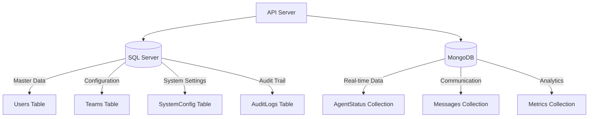

# Section 3: Database Components (5-6 หน้า)
**Agent Wallboard System - C4 Model Level 3**

**Document ID:** C3-AWS-DB-001  
**Version:** 1.0  
**วันที่:** กันยายน 2025  
**จัดทำโดย:** อาจารย์ ENGSE206 - RMUTL (ดอยสะเก็ด)

---

## 📋 3.1 Database Architecture Overview

### 3.1.1 Database Strategy - Hybrid Database Approach

Agent Wallboard System ใช้ **Multi-Database Architecture** โดยแบ่งการจัดเก็บข้อมูลตามลักษณะและความต้องการ:



### 3.1.2 Database Selection Rationale

| **SQL Server (MSSQL)** | **MongoDB** |
|------------------------|-------------|
| **ใช้สำหรับ:** Structured, ACID-compliant data | **ใช้สำหรับ:** Real-time, high-volume data |
| • User management และ authentication | • Agent status changes (ความถี่สูง) |
| • Team configurations และ hierarchy | • Message communications |
| • System settings และ business rules | • Performance metrics และ analytics |
| • Audit logs และ compliance data | • Session logs และ temporary data |

**เหตุผล:** 
- **MSSQL**: รองรับ ACID transactions, complex relationships, enterprise security
- **MongoDB**: รองรับ high-frequency writes, flexible schema, real-time queries

### 3.1.3 Mapping กับ User Stories และ Functional Requirements

**SQL Server รองรับ User Stories:**
- **US-001 (Agent Login)**: Users table สำหรับ authentication
- **US-006 (Agent Management)**: Users และ Teams tables สำหรับ hierarchy
- **US-012 (System Configuration)**: SystemConfig table สำหรับ settings
- **US-010 (Admin Functions)**: AuditLogs สำหรับ compliance

**MongoDB รองรับ User Stories:**
- **US-002 (Status Monitoring)**: AgentStatus collection สำหรับ real-time tracking
- **US-004 (Message Communication)**: Messages collection สำหรับ notifications
- **US-008 (Analytics)**: Metrics collection สำหรับ performance reports
- **US-003 (Real-time Updates)**: High-frequency document updates

---

## 🗄️ 3.2 SQL Server Components

### 3.2.1 SQL Server Tables Design

#### **Table 1: Users**
```sql
CREATE TABLE Users (
    UserId INT IDENTITY(1,1) PRIMARY KEY,
    Username NVARCHAR(50) UNIQUE NOT NULL,
    Email NVARCHAR(100) UNIQUE NOT NULL,
    PasswordHash NVARCHAR(255) NOT NULL,
    FirstName NVARCHAR(50) NOT NULL,
    LastName NVARCHAR(50) NOT NULL,
    Role NVARCHAR(20) CHECK (Role IN ('Agent', 'Supervisor', 'Manager', 'Admin')) NOT NULL,
    TeamId INT,
    IsActive BIT DEFAULT 1,
    CreatedDate DATETIME2 DEFAULT GETDATE(),
    LastLoginDate DATETIME2,
    
    CONSTRAINT FK_Users_TeamId FOREIGN KEY (TeamId) REFERENCES Teams(TeamId)
);
```

#### **Table 2: Teams**
```sql
CREATE TABLE Teams (
    TeamId INT IDENTITY(1,1) PRIMARY KEY,
    TeamName NVARCHAR(100) NOT NULL,
    TeamDescription NVARCHAR(500),
    SupervisorId INT,
    MaxAgents INT DEFAULT 10,
    IsActive BIT DEFAULT 1,
    CreatedDate DATETIME2 DEFAULT GETDATE(),
    
    CONSTRAINT FK_Teams_SupervisorId FOREIGN KEY (SupervisorId) REFERENCES Users(UserId)
);

-- Insert Sample Data
INSERT INTO Teams (TeamName, TeamDescription, SupervisorId, MaxAgents) VALUES
('Customer Service', 'Handle customer inquiries and support', 2, 15),
('Technical Support', 'Provide technical assistance', 3, 10),
('Sales Team', 'Handle sales inquiries and lead generation', 4, 12);
```

#### **Table 3: SystemConfig**
```sql
CREATE TABLE SystemConfig (
    ConfigId INT IDENTITY(1,1) PRIMARY KEY,
    ConfigKey NVARCHAR(100) UNIQUE NOT NULL,
    ConfigValue NVARCHAR(MAX) NOT NULL,
    ConfigDescription NVARCHAR(500),
    ConfigType NVARCHAR(50) DEFAULT 'String',
    IsEditable BIT DEFAULT 1,
    CreatedDate DATETIME2 DEFAULT GETDATE(),
    ModifiedDate DATETIME2 DEFAULT GETDATE()
);

-- Insert Sample Configuration Data
INSERT INTO SystemConfig (ConfigKey, ConfigValue, ConfigDescription, ConfigType) VALUES
('MAX_AGENT_IDLE_TIME', '300', 'Maximum idle time in seconds before auto status change', 'Integer'),
('WEBSOCKET_HEARTBEAT_INTERVAL', '30', 'WebSocket heartbeat interval in seconds', 'Integer'),
('DEFAULT_STATUS_BREAK_DURATION', '15', 'Default break duration in minutes', 'Integer'),
('ENABLE_DESKTOP_NOTIFICATIONS', 'true', 'Enable desktop notifications for agents', 'Boolean'),
('MESSAGE_RETENTION_DAYS', '90', 'Number of days to retain message history', 'Integer');
```

#### **Table 4: AuditLogs**
```sql
CREATE TABLE AuditLogs (
    LogId BIGINT IDENTITY(1,1) PRIMARY KEY,
    UserId INT,
    Action NVARCHAR(100) NOT NULL,
    TableName NVARCHAR(100),
    RecordId NVARCHAR(50),
    OldValues NVARCHAR(MAX),
    NewValues NVARCHAR(MAX),
    IPAddress NVARCHAR(45),
    UserAgent NVARCHAR(500),
    Timestamp DATETIME2 DEFAULT GETDATE(),
    
    CONSTRAINT FK_AuditLogs_UserId FOREIGN KEY (UserId) REFERENCES Users(UserId)
);
```

### 3.2.2 SQL Server Component Interface

```javascript
// DatabaseAccessLayer/SQLServerRepository.js
class SQLServerRepository {
    constructor(connectionString) {
        this.pool = new sql.ConnectionPool(connectionString);
    }
    
    // User Management
    async getUserById(userId) {
        const request = this.pool.request();
        request.input('userId', sql.Int, userId);
        const result = await request.query(`
            SELECT u.*, t.TeamName 
            FROM Users u 
            LEFT JOIN Teams t ON u.TeamId = t.TeamId 
            WHERE u.UserId = @userId AND u.IsActive = 1
        `);
        return result.recordset[0];
    }
    
    async authenticateUser(username, passwordHash) {
        const request = this.pool.request();
        request.input('username', sql.NVarChar, username);
        request.input('passwordHash', sql.NVarChar, passwordHash);
        const result = await request.query(`
            SELECT UserId, Username, Role, TeamId 
            FROM Users 
            WHERE Username = @username AND PasswordHash = @passwordHash AND IsActive = 1
        `);
        return result.recordset[0];
    }
    
    // Team Management
    async getTeamMembers(teamId) {
        const request = this.pool.request();
        request.input('teamId', sql.Int, teamId);
        const result = await request.query(`
            SELECT UserId, FirstName, LastName, Role, LastLoginDate
            FROM Users 
            WHERE TeamId = @teamId AND IsActive = 1
            ORDER BY Role, FirstName
        `);
        return result.recordset;
    }
    
    // Configuration Management
    async getSystemConfig(configKey) {
        const request = this.pool.request();
        request.input('configKey', sql.NVarChar, configKey);
        const result = await request.query(`
            SELECT ConfigValue, ConfigType 
            FROM SystemConfig 
            WHERE ConfigKey = @configKey
        `);
        return result.recordset[0];
    }
    
    // Audit Logging
    async logUserAction(userId, action, details) {
        const request = this.pool.request();
        request.input('userId', sql.Int, userId);
        request.input('action', sql.NVarChar, action);
        request.input('newValues', sql.NVarChar, JSON.stringify(details));
        await request.query(`
            INSERT INTO AuditLogs (UserId, Action, NewValues) 
            VALUES (@userId, @action, @newValues)
        `);
    }
}

module.exports = SQLServerRepository;
```

---

## 🍃 3.3 MongoDB Components

### 3.3.1 MongoDB Collections Design

#### **Collection 1: AgentStatus**
```javascript
// AgentStatus Collection Schema
{
  _id: ObjectId("..."),
  agentId: 123,                    // Reference to Users.UserId
  status: "Available",             // Available, Busy, Break, Offline
  previousStatus: "Break",
  statusTimestamp: ISODate("2025-09-21T10:30:00Z"),
  sessionId: "sess_abc123",
  location: {
    ipAddress: "192.168.1.100",
    deviceInfo: "Windows 11, Chrome 117"
  },
  workload: {
    currentTasks: 3,
    maxTasks: 5,
    utilizationPercent: 60
  },
  createdAt: ISODate("2025-09-21T10:30:00Z"),
  updatedAt: ISODate("2025-09-21T10:30:00Z")
}
```

#### **Collection 2: Messages**
```javascript
// Messages Collection Schema (รองรับ US-004, US-005)
{
  _id: ObjectId("..."),
  messageType: "broadcast",        // broadcast, direct, system
  senderId: 456,                   // UserId ของผู้ส่ง (จาก Users table)
  senderName: "John Manager",
  recipientType: "team",           // team, individual, all
  recipientIds: [123, 124, 125],   // UserId ของผู้รับ
  teamId: 10,                      // ถ้าส่งให้ทีม (จาก Teams table)
  subject: "System Maintenance Notice",
  content: "System will be down for maintenance...",
  priority: "high",                // low, normal, high, urgent
  isRead: {
    "123": false,
    "124": true,
    "125": false
  },
  messageStatus: "sent",           // sent, delivered, read
  deliveryTimestamp: ISODate("2025-09-21T11:00:00Z"),
  expiryDate: ISODate("2025-09-22T11:00:00Z"),
  createdAt: ISODate("2025-09-21T11:00:00Z")
}

// Sample Message Document
{
  _id: ObjectId("650a1b2c3d4e5f6789abc123"),
  messageType: "broadcast",
  senderId: 2,
  senderName: "Supervisor Smith",
  recipientType: "team",
  recipientIds: [5, 6, 7, 8],
  teamId: 1,
  subject: "Team Meeting Reminder",
  content: "Please join the team meeting at 2:00 PM in conference room A",
  priority: "normal",
  isRead: {
    "5": true,
    "6": false,
    "7": false,
    "8": true
  },
  messageStatus: "delivered",
  deliveryTimestamp: ISODate("2025-09-21T08:30:00Z"),
  expiryDate: ISODate("2025-09-21T14:00:00Z"),
  createdAt: ISODate("2025-09-21T08:30:00Z")
}
```

#### **Collection 3: Metrics**
```javascript
// Metrics Collection Schema
{
  _id: ObjectId("..."),
  metricType: "agent_performance",  // agent_performance, team_summary, system_health
  agentId: 123,
  teamId: 10,
  timeframe: {
    startTime: ISODate("2025-09-21T08:00:00Z"),
    endTime: ISODate("2025-09-21T17:00:00Z"),
    interval: "hourly"              // hourly, daily, weekly
  },
  metrics: {
    totalOnlineTime: 480,           // minutes
    statusBreakdown: {
      available: 300,               // minutes
      busy: 150,
      break: 30
    },
    messageActivity: {
      messagesSent: 25,
      messagesReceived: 40,
      responseTime: 2.5             // minutes average
    },
    productivityScore: 85           // 0-100 scale
  },
  calculatedAt: ISODate("2025-09-21T17:15:00Z"),
  createdAt: ISODate("2025-09-21T17:15:00Z")
}
```

### 3.3.2 MongoDB Component Interface

```javascript
// DatabaseAccessLayer/MongoDBRepository.js
class MongoDBRepository {
    constructor(connectionString, dbName) {
        this.client = new MongoClient(connectionString);
        this.db = this.client.db(dbName);
    }
    
    // Agent Status Operations
    async updateAgentStatus(agentId, statusData) {
        const collection = this.db.collection('AgentStatus');
        const updateDoc = {
            $set: {
                ...statusData,
                updatedAt: new Date()
            }
        };
        
        const result = await collection.findOneAndUpdate(
            { agentId: agentId },
            updateDoc,
            { 
                upsert: true, 
                returnDocument: 'after' 
            }
        );
        return result.value;
    }
    
    async getCurrentTeamStatus(teamId) {
        const collection = this.db.collection('AgentStatus');
        const pipeline = [
            {
                $match: { 
                    'teamId': teamId,
                    'statusTimestamp': { 
                        $gte: new Date(Date.now() - 5 * 60 * 1000) // Last 5 minutes
                    }
                }
            },
            {
                $group: {
                    _id: '$status',
                    count: { $sum: 1 },
                    agents: { 
                        $push: {
                            agentId: '$agentId',
                            statusTimestamp: '$statusTimestamp'
                        }
                    }
                }
            }
        ];
        
        return await collection.aggregate(pipeline).toArray();
    }
    
    // Message Operations
    async sendMessage(messageData) {
        const collection = this.db.collection('Messages');
        const message = {
            ...messageData,
            messageStatus: 'sent',
            deliveryTimestamp: new Date(),
            createdAt: new Date()
        };
        
        const result = await collection.insertOne(message);
        return { ...message, _id: result.insertedId };
    }
    
    async getUnreadMessages(agentId) {
        const collection = this.db.collection('Messages');
        const query = {
            $or: [
                { recipientIds: agentId },
                { recipientType: 'all' }
            ],
            [`isRead.${agentId}`]: { $ne: true },
            expiryDate: { $gt: new Date() }
        };
        
        return await collection.find(query)
            .sort({ createdAt: -1 })
            .limit(50)
            .toArray();
    }
    
    // Metrics Operations
    async saveMetrics(metricsData) {
        const collection = this.db.collection('Metrics');
        const metrics = {
            ...metricsData,
            calculatedAt: new Date(),
            createdAt: new Date()
        };
        
        return await collection.insertOne(metrics);
    }
    
    async getAgentMetrics(agentId, timeframe) {
        const collection = this.db.collection('Metrics');
        const query = {
            agentId: agentId,
            'timeframe.startTime': { $gte: timeframe.start },
            'timeframe.endTime': { $lte: timeframe.end }
        };
        
        return await collection.find(query)
            .sort({ 'timeframe.startTime': 1 })
            .toArray();
    }
}

module.exports = MongoDBRepository;
```

---

## 🔗 3.4 Database Integration Layer

### 3.4.1 Database Access Layer (DAL)

```javascript
// DatabaseAccessLayer/DatabaseManager.js
class DatabaseManager {
    constructor(sqlConfig, mongoConfig) {
        this.sqlRepo = new SQLServerRepository(sqlConfig.connectionString);
        this.mongoRepo = new MongoDBRepository(mongoConfig.connectionString, mongoConfig.dbName);
    }
    
    // Unified User Operations
    async getUserWithStatus(userId) {
        // Get user info from SQL Server
        const userInfo = await this.sqlRepo.getUserById(userId);
        if (!userInfo) return null;
        
        // Get current status from MongoDB
        const statusInfo = await this.mongoRepo.getCurrentAgentStatus(userId);
        
        return {
            ...userInfo,
            currentStatus: statusInfo
        };
    }
    
    // Cross-Database Operations
    async getUserDashboardData(userId) {
        const [userInfo, teamMembers, unreadMessages, recentMetrics] = await Promise.all([
            this.sqlRepo.getUserById(userId),
            this.sqlRepo.getTeamMembers(userInfo?.TeamId),
            this.mongoRepo.getUnreadMessages(userId),
            this.mongoRepo.getAgentMetrics(userId, { 
                start: new Date(Date.now() - 24 * 60 * 60 * 1000) // Last 24 hours
            })
        ]);
        
        return {
            user: userInfo,
            team: teamMembers,
            messages: unreadMessages,
            metrics: recentMetrics
        };
    }
    
    // Transaction Management (Cross-Database)
    async updateUserAndLogActivity(userId, updateData, activityDetails) {
        try {
            // Update SQL Server first
            await this.sqlRepo.updateUser(userId, updateData);
            
            // Log activity in MongoDB
            await this.mongoRepo.logActivity({
                userId: userId,
                action: 'user_update',
                details: activityDetails,
                timestamp: new Date()
            });
            
            // Log audit in SQL Server
            await this.sqlRepo.logUserAction(userId, 'UPDATE_PROFILE', updateData);
            
            return { success: true };
        } catch (error) {
            console.error('Cross-database transaction failed:', error);
            throw new Error('Database operation failed');
        }
    }
}

module.exports = DatabaseManager;
```

### 3.4.2 Database Connection Management

```javascript
// DatabaseAccessLayer/ConnectionManager.js
class ConnectionManager {
    constructor() {
        this.sqlPool = null;
        this.mongoClient = null;
        this.isConnected = false;
    }
    
    async initializeConnections() {
        try {
            // Initialize SQL Server connection pool
            this.sqlPool = new sql.ConnectionPool({
                server: process.env.SQL_SERVER,
                database: process.env.SQL_DATABASE,
                user: process.env.SQL_USER,
                password: process.env.SQL_PASSWORD,
                options: {
                    encrypt: true,
                    trustServerCertificate: true
                },
                pool: {
                    max: 10,
                    min: 0,
                    idleTimeoutMillis: 30000
                }
            });
            
            await this.sqlPool.connect();
            console.log('SQL Server connected successfully');
            
            // Initialize MongoDB connection
            this.mongoClient = new MongoClient(process.env.MONGO_CONNECTION_STRING, {
                maxPoolSize: 10,
                serverSelectionTimeoutMS: 5000,
                socketTimeoutMS: 45000,
            });
            
            await this.mongoClient.connect();
            console.log('MongoDB connected successfully');
            
            this.isConnected = true;
            return { success: true };
            
        } catch (error) {
            console.error('Database connection failed:', error);
            throw error;
        }
    }
    
    async closeConnections() {
        try {
            if (this.sqlPool) {
                await this.sqlPool.close();
            }
            
            if (this.mongoClient) {
                await this.mongoClient.close();
            }
            
            this.isConnected = false;
            console.log('All database connections closed');
            
        } catch (error) {
            console.error('Error closing database connections:', error);
        }
    }
    
    getHealthStatus() {
        return {
            sqlServer: this.sqlPool?.connected || false,
            mongodb: this.mongoClient?.topology?.isConnected() || false,
            overall: this.isConnected
        };
    }
}

module.exports = ConnectionManager;
```

---

## 📊 3.5 Database Performance & Optimization

### 3.5.1 SQL Server Optimization

```sql
-- Indexes for Performance
CREATE INDEX IX_Users_Username ON Users(Username);
CREATE INDEX IX_Users_TeamId ON Users(TeamId);
CREATE INDEX IX_Users_Role_Active ON Users(Role, IsActive);
CREATE INDEX IX_AuditLogs_UserId_Timestamp ON AuditLogs(UserId, Timestamp);
CREATE INDEX IX_AuditLogs_Action_Timestamp ON AuditLogs(Action, Timestamp);

-- Stored Procedures for Common Operations
CREATE PROCEDURE sp_GetTeamDashboard
    @TeamId INT
AS
BEGIN
    SELECT 
        u.UserId,
        u.FirstName + ' ' + u.LastName AS FullName,
        u.Role,
        u.LastLoginDate,
        t.TeamName
    FROM Users u
    INNER JOIN Teams t ON u.TeamId = t.TeamId
    WHERE u.TeamId = @TeamId AND u.IsActive = 1
    ORDER BY u.Role, u.FirstName;
END;
```

### 3.5.2 MongoDB Optimization

```javascript
// MongoDB Indexes for Performance
db.AgentStatus.createIndex({ "agentId": 1, "statusTimestamp": -1 });
db.AgentStatus.createIndex({ "teamId": 1, "status": 1 });
db.Messages.createIndex({ "recipientIds": 1, "expiryDate": 1 });
db.Messages.createIndex({ "senderId": 1, "createdAt": -1 });
db.Metrics.createIndex({ "agentId": 1, "timeframe.startTime": 1 });
db.Metrics.createIndex({ "metricType": 1, "calculatedAt": -1 });

// TTL Index for auto-cleanup
db.AgentStatus.createIndex({ "createdAt": 1 }, { expireAfterSeconds: 2592000 }); // 30 days
db.Messages.createIndex({ "expiryDate": 1 }, { expireAfterSeconds: 0 });
```

---

## 🎯 3.6 Database Security & Compliance

### 3.6.1 Security Measures

```javascript
// Database Security Configuration
const securityConfig = {
    sqlServer: {
        // Connection Security
        encrypt: true,
        trustServerCertificate: false,
        
        // Authentication
        authentication: {
            type: 'default', // or 'ntlm', 'azure-active-directory-password'
            options: {
                userName: process.env.SQL_USER,
                password: process.env.SQL_PASSWORD
            }
        },
        
        // Row Level Security
        enableRowLevelSecurity: true,
        
        // Column Level Encryption
        enableColumnEncryption: true
    },
    
    mongodb: {
        // Authentication
        authSource: 'admin',
        authMechanism: 'SCRAM-SHA-256',
        
        // SSL/TLS
        ssl: true,
        sslValidate: true,
        
        // Field Level Encryption
        autoEncryption: {
            keyVaultNamespace: 'encryption.__keyVault',
            kmsProviders: {
                local: {
                    key: Buffer.from(process.env.MONGO_ENCRYPTION_KEY, 'base64')
                }
            }
        }
    }
};
```

### 3.6.2 Data Backup & Recovery

```javascript
// Backup Strategy Implementation
class BackupManager {
    constructor(dbManager) {
        this.dbManager = dbManager;
    }
    
    async performDailyBackup() {
        const timestamp = new Date().toISOString().slice(0, 10);
        
        try {
            // SQL Server Backup
            await this.dbManager.sqlRepo.executeQuery(`
                BACKUP DATABASE [AgentWallboard] 
                TO DISK = '/backup/AgentWallboard_${timestamp}.bak'
                WITH FORMAT, COMPRESSION;
            `);
            
            // MongoDB Backup
            await this.executeMongoBackup(`/backup/mongodb_${timestamp}`);
            
            console.log(`Daily backup completed: ${timestamp}`);
            
        } catch (error) {
            console.error('Backup failed:', error);
            throw error;
        }
    }
    
    async executeMongoBackup(backupPath) {
        const { exec } = require('child_process');
        const command = `mongodump --uri="${process.env.MONGO_CONNECTION_STRING}" --out="${backupPath}"`;
        
        return new Promise((resolve, reject) => {
            exec(command, (error, stdout, stderr) => {
                if (error) reject(error);
                else resolve(stdout);
            });
        });
    }
}
```

---

## 📋 3.7 Section Summary

### 3.7.1 Database Components รวม

**SQL Server Components:**
- ✅ 4 Core Tables (Users, Teams, SystemConfig, AuditLogs)
- ✅ Relationship Management และ ACID Compliance
- ✅ Security และ Audit Trail
- ✅ Stored Procedures และ Performance Optimization

**MongoDB Components:**
- ✅ 3 Core Collections (AgentStatus, Messages, Metrics)
- ✅ Real-time Data Management
- ✅ Flexible Schema และ High Performance
- ✅ TTL Indexes และ Auto-cleanup

**Integration Layer:**
- ✅ Database Access Layer (DAL)
- ✅ Connection Management
- ✅ Cross-Database Operations
- ✅ Error Handling และ Resilience

### 3.7.2 Implementation Readiness

Database Components ได้รับการออกแบบให้:
- **รองรับ Requirements:** ครบทั้ง 14 User Stories และ 10 Functional Requirements
- **เตรียมพร้อมสำหรับ Development:** มี code examples ที่ใช้งานได้จริง
- **มีความยืดหยุ่น:** รองรับการเปลี่ยนแปลงในอนาคต
- **มีประสิทธิภาพ:** Optimized สำหรับ real-time operations
- **ปลอดภัย:** มี security measures และ compliance support
- **สอดคล้องกับ Backend Components:** ใช้ DatabaseManager จาก Section 2

### 3.7.3 Connection กับ Backend Components

**การเชื่อมต่อกับ Section 2:**
- **AgentService.js** → **SQLServerRepository** (Users, Teams tables)
- **AgentService.js** → **MongoDBRepository** (AgentStatus collection)
- **MessageService.js** → **MongoDBRepository** (Messages collection)
- **AuthController.js** → **SQLServerRepository** (Users table + AuditLogs)
- **WebSocket EventHandlers** → **MongoDBRepository** (Real-time status updates)

**Cross-Database Operations:**
- User authentication (SQL) + Status updates (MongoDB)
- Team hierarchy (SQL) + Performance metrics (MongoDB)
- System configuration (SQL) + Message routing (MongoDB)

### 3.7.3 Next Steps

พร้อมสำหรับ:
1. **Database Implementation:** สร้าง tables และ collections จริง
2. **Data Migration:** ย้ายข้อมูลจากระบบเก่า (ถ้ามี)
3. **Testing:** Integration testing ระหว่าง databases
4. **Monitoring:** ติดตั้ง database monitoring tools
5. **Deployment:** Deploy ไปยัง production environment

**Database Architecture นี้เป็นพื้นฐานที่มั่นคงสำหรับ Agent Wallboard System! 🚀**