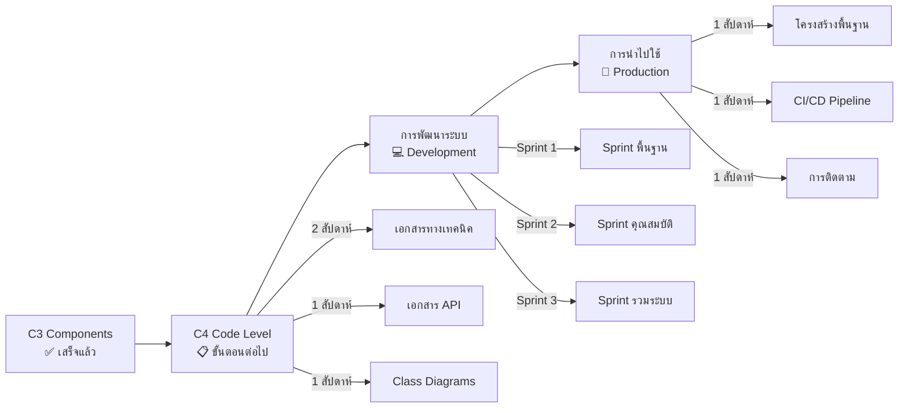
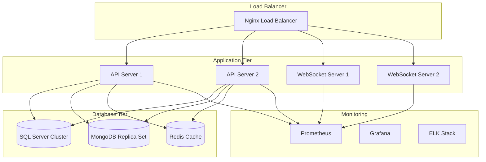

# 🚀 แผนงาน C4 Code Level และการพัฒนาระบบจริง
**Agent Wallboard System - จาก Design สู่ Code จริง**

**รหัสเอกสาร:** C4-IMPLEMENTATION-TH-001  
**เวอร์ชัน:** 1.0  
**วันที่:** กันยายน 2025  
**เป้าหมาย:** สำหรับทีมนักศึกษา Software Engineer ที่มี Scrum Team

---

## 📋 ภาพรวม: จาก C3 สู่ระบบที่ใช้งานจริง

### สถานะปัจจุบัน: C3 Components เสร็จสมบูรณ์แล้ว ✅
- **Section 1:** Frontend Components (7 หน้า) - UI mockups, React code, UML
- **Section 2:** Backend Components (7 หน้า) - API endpoints, WebSocket, Services  
- **Section 3:** Database Components (6 หน้า) - MSSQL + MongoDB, DAL

### ขั้นตอนต่อไป: การเดินทาง C4 + Implementation 🎯



---

## 📚 ระยะที่ 1: การออกแบบ C4 Code Level (3-4 สัปดาห์)

### 1.1 กลยุทธ์การจัดทำเอกสาร C4

**เป้าหมาย:** สร้างเอกสารระดับ Code ที่นักพัฒนาใช้งานได้จริง

#### **โครงสร้างเอกสาร:**
```
📄 เอกสาร C4 Code Level (15-20 หน้า)
├── 🔧 ส่วนที่ 1: Class Diagrams และ Object Models (5-6 หน้า)
├── 📡 ส่วนที่ 2: API Specifications และ Contracts (4-5 หน้า)
├── 💾 ส่วนที่ 3: Database Schema และ Optimization (3-4 หน้า)
├── 🔐 ส่วนที่ 4: Security และรายละเอียด Authentication (2-3 หน้า)
└── 🧪 ส่วนที่ 5: Testing Strategy และ Quality Gates (2-3 หน้า)
```

### 1.2 แผนการทำงานแบบสัปดาห์ต่อสัปดาห์

#### **สัปดาห์ที่ 1: Class Diagrams และ Object Models**
**เป้าหมาย:** สร้างโครงสร้าง class แบบละเอียดสำหรับทุก components

**ผลงานที่ต้องส่งมอบ:**
- **Frontend Classes:** โครงสร้าง React component hierarchies, Hook dependencies, Service classes
- **Backend Classes:** Class diagrams ของ Controller/Service/Repository พร้อม methods
- **Database Models:** ORM models, Entity relationships, Data Transfer Objects

**ตัวอย่างผลงาน:**
```typescript
// ตัวอย่าง Frontend Class
interface AgentStatusManager {
  currentStatus: AgentStatus;
  updateStatus(newStatus: AgentStatus): Promise<boolean>;
  validateTransition(from: AgentStatus, to: AgentStatus): ValidationResult;
  subscribeToUpdates(callback: StatusUpdateCallback): Subscription;
}

// ตัวอย่าง Backend Class  
class AgentController {
  constructor(private agentService: AgentService) {}
  
  @Put('/agents/:id/status')
  async updateStatus(@Param('id') agentId: string, @Body() statusData: UpdateStatusDto): Promise<StatusResponse> {
    // รายละเอียดการ implement
  }
}
```

#### **สัปดาห์ที่ 2: API Specifications และ Contracts**
**เป้าหมาย:** สร้างเอกสาร OpenAPI/Swagger ที่สมบูรณ์

**ผลงานที่ต้องส่งมอบ:**
- **REST API Specs:** OpenAPI 3.0 specification ที่สมบูรณ์
- **WebSocket Events:** Event schemas และ message formats
- **Error Handling:** การจัดการ Error responses แบบมาตรฐาน
- **Authentication:** JWT token specs และ security schemes

**ตัวอย่างผลงาน:**
```yaml
# ตัวอย่าง OpenAPI Specification
paths:
  /api/agents/{agentId}/status:
    put:
      summary: อัปเดตสถานะ agent
      parameters:
        - name: agentId
          in: path
          required: true
          schema:
            type: string
      requestBody:
        required: true
        content:
          application/json:
            schema:
              $ref: '#/components/schemas/StatusUpdateRequest'
      responses:
        '200':
          description: อัปเดตสถานะสำเร็จ
          content:
            application/json:
              schema:
                $ref: '#/components/schemas/StatusResponse'
```

#### **สัปดาห์ที่ 3: Database Schema และ Query Optimization**
**เป้าหมาย:** จบรายละเอียดการ implement database

**ผลงานที่ต้องส่งมอบ:**
- **SQL Scripts:** คำสั่ง CREATE TABLE พร้อม indexes
- **MongoDB Schemas:** กฎการ validate collection และ indexes
- **Query Optimization:** การวิเคราะห์ slow query และ optimization strategies
- **Migration Scripts:** การ version database และ migration procedures

#### **สัปดาห์ที่ 4: Security และ Testing Strategy**
**เป้าหมาย:** จบ security implementation และ testing framework

**ผลงานที่ต้องส่งมอบ:**
- **Security Implementation:** Authentication flows, authorization middleware
- **Testing Strategy:** แผน Unit/Integration/E2E testing
- **Quality Gates:** ข้อกำหนด Code coverage, performance benchmarks
- **Documentation Review:** แพ็คเกจเอกสารทางเทคนิคที่สมบูรณ์

---

## 💻 ระยะที่ 2: การพัฒนาด้วย Scrum (8-12 สัปดาห์)

### 2.1 การจัดตั้งทีม Scrum

#### **โครงสร้างทีมที่แนะนำ:**
- **Product Owner:** 1 คน (จากฝั่งธุรกิจ)
- **Scrum Master:** 1 คน (นักพัฒนาที่มีประสบการณ์)
- **Development Team:** 4-6 นักพัฒนา
  - **Frontend Developers:** 2 คน (ผู้เชี่ยวชาญ React/Electron)
  - **Backend Developers:** 2 คน (ผู้เชี่ยวชาญ Node.js/API)  
  - **Full-stack Developer:** 1 คน (Database + DevOps)
  - **QA Engineer:** 1 คน (ผู้เชี่ยวชาญการทดสอบ)

#### **ระยะเวลา Sprint:** 2 สัปดาห์ต่อ sprint
**จำนวน Sprint รวม:** 4-6 sprints

### 2.2 กลยุทธ์การวางแผน Sprint

#### **Sprint 1: พื้นฐานและโครงสร้าง (2 สัปดาห์)**
**Sprint Goal:** ตั้งค่า development environment และ core authentication

**ลำดับความสำคัญ User Stories:**
- **US-010:** Admin Functions (การตั้งค่าโครงสร้างพื้นฐาน)
- **US-001:** Agent Login (พื้นฐาน Authentication)
- **US-012:** System Configuration (การจัดการ config พื้นฐาน)

**งานทางเทคนิค:**
- ตั้งค่า Development environment (Docker, databases)
- ตั้งค่า CI/CD pipeline พื้นฐาน
- พัฒนา Authentication service
- โครงสร้าง API server พื้นฐาน
- สร้าง Database schema

**Definition of Done:**
- ✅ นักพัฒนาสามารถรันระบบในเครื่องได้
- ✅ Authentication พื้นฐานทำงานได้
- ✅ Database tables ถูกสร้างและเข้าถึงได้
- ✅ CI pipeline ทำงานและทดสอบได้
- ✅ Code coverage > 80%

#### **Sprint 2: คุณสมบัติหลัก (2 สัปดาห์)**
**Sprint Goal:** พัฒนาฟังก์ชันหลักของ agent

**ลำดับความสำคัญ User Stories:**
- **US-002:** Agent Status Management
- **US-006:** Agent Management  
- **US-011:** User Management

**งานทางเทคนิค:**
- Agent Desktop App core components
- Agent status API endpoints
- User management backend
- Admin panel พื้นฐาน
- การดำเนินการ Database (Users, Teams tables)

**Definition of Done:**
- ✅ Agents สามารถเปลี่ยนสถานะได้
- ✅ Admin สามารถจัดการ users ได้
- ✅ Real-time status updates ทำงานได้
- ✅ APIs ทั้งหมดมี error handling
- ✅ Unit tests สำหรับ services ทั้งหมด

#### **Sprint 3: การสื่อสาร Real-time (2 สัปดาห์)**
**Sprint Goal:** พัฒนา real-time messaging และการติดตาม

**ลำดับความสำคัญ User Stories:**
- **US-003:** Real-time Agent Monitoring
- **US-004:** Message Broadcasting
- **US-007:** Agent Message Receiving

**งานทางเทคนิค:**
- พัฒนา WebSocket server
- คุณสมบัติหลัก Supervisor dashboard
- ระบบ Message (ส่ง/รับ)
- Real-time status broadcasting
- Interface การติดตามทีม

**Definition of Done:**
- ✅ Real-time updates ทำงานข้าม clients
- ✅ Messages ส่งและรับได้สำเร็จ
- ✅ Supervisor สามารถติดตามทีมได้
- ✅ WebSocket connections เสถียร
- ✅ Integration tests ผ่าน

#### **Sprint 4: Analytics และ Reports (2 สัปดาห์)**
**Sprint Goal:** ทำ dashboard analytics และ reporting ให้เสร็จ

**ลำดับความสำคัญ User Stories:**
- **US-008:** Dashboard Analytics
- **US-009:** Performance Reports
- **US-005:** Agent Notifications

**งานทางเทคนิค:**
- Analytics components
- การเก็บ Performance metrics
- ระบบ Notification
- การสร้าง Report
- การแสดงผลข้อมูล

**Definition of Done:**
- ✅ Analytics dashboard ทำงานได้
- ✅ Reports สร้างได้ถูกต้อง
- ✅ Notifications ทำงานได้
- ✅ Performance ยอมรับได้
- ✅ E2E tests ครอบคลุม main flows

#### **Sprint 5: ปรับปรุงและ Optimization (2 สัปดาห์)**
**Sprint Goal:** Performance optimization และแก้ bugs

**ลำดับความสำคัญ User Stories:**
- **US-013:** Mobile Support
- **US-014:** Configuration Management
- การปรับปรุง Performance
- แก้ bugs จาก sprints ก่อนหน้า

**งานทางเทคนิค:**
- พัฒนา Responsive design
- Performance optimization
- เสริมความปลอดภัย Security
- แก้ไขและปรับปรุง
- ทำเอกสารให้เสร็จ

**Definition of Done:**
- ✅ Mobile interface ทำงานได้
- ✅ ประสิทธิภาพระบบตามข้อกำหนด
- ✅ ผ่าน Security audit
- ✅ แก้ bugs สำคัญทั้งหมด
- ✅ เอกสารครบถ้วน

#### **Sprint 6: การนำไปใช้และ Go-Live (2 สัปดาห์)**
**Sprint Goal:** การนำไปใช้ Production และตั้งค่าการติดตาม

**งานทางเทคนิค:**
- ตั้งค่า Production environment
- ระบบ Deployment อัตโนมัติ
- การติดตามและ alerting
- เอกสารการฝึกอบรมผู้ใช้
- สนับสนุน Go-live

**Definition of Done:**
- ✅ ระบบถูกนำไปใช้ใน production
- ✅ การติดตามและ alerts ทำงาน
- ✅ ผู้ใช้ได้รับการฝึกอบรม
- ✅ การติดตาม performance ทำงาน
- ✅ ส่งมอบให้ทีม operations

### 2.3 มาตรฐานการพัฒนา

#### **มาตรฐานคุณภาพ Code:**
- **Test Coverage:** Coverage ขั้นต่ำ 80%
- **Code Review:** PRs ทั้งหมดต้องการการอนุมัติ 2 คน
- **Linting:** ESLint + Prettier เพื่อความสม่ำเสมอ
- **Documentation:** JSDoc comments สำหรับ public APIs ทั้งหมด
- **Performance:** เวลา API response < 200ms

#### **Git Workflow:**
```
main branch (พร้อมใช้ production)
├── develop branch (integration)
├── feature/US-001-agent-login
├── feature/US-002-status-management
├── hotfix/critical-bug-fix
└── release/v1.0.0
```

#### **Definition of Ready (DoR):**
- User story มี acceptance criteria
- งานทางเทคนิคถูกระบุ
- Dependencies ได้รับการแก้ไข
- Test scenarios ถูกกำหนด
- UI mockups พร้อมใช้งาน (สำหรับ frontend stories)

#### **Definition of Done (DoD):**
- Code เขียนและ review แล้ว
- Unit tests เขียนและผ่าน
- Integration tests ผ่าน
- เอกสารอัปเดตแล้ว
- Deploy ไป staging environment
- Product Owner ยอมรับ

---

## 🚀 ระยะที่ 3: การนำไปใช้และการดำเนินงาน (2-3 สัปดาห์)

### 3.1 การตั้งค่าโครงสร้างพื้นฐาน

#### **สถาปัตยกรรม Production:**


#### **การกำหนดค่า Environment:**

**Development:**
- Local Docker containers
- SQLite สำหรับการพัฒนาอย่างรวดเร็ว
- MongoDB single instance
- เปิดใช้งาน Hot reloading

**Staging:**
- Kubernetes cluster
- การตั้งค่า database แบบ Production
- Monitoring stack เต็มรูปแบบ
- การทดสอบอัตโนมัติ

**Production:**
- การตั้งค่า High availability
- Database clustering
- CDN สำหรับ static assets
- การติดตามที่ครอบคลุม

### 3.2 CI/CD Pipeline

#### **ขั้นตอน Pipeline:**
```yaml
# ตัวอย่าง .gitlab-ci.yml
stages:
  - test
  - build
  - deploy-staging
  - integration-tests
  - deploy-production

test:
  stage: test
  script:
    - npm install
    - npm run test:unit
    - npm run test:integration
    - npm run lint
  coverage: '/Lines\s*:\s*(\d+\.\d+)%/'

build:
  stage: build
  script:
    - docker build -t agent-wallboard:$CI_COMMIT_SHA .
    - docker push registry/agent-wallboard:$CI_COMMIT_SHA

deploy-staging:
  stage: deploy-staging
  script:
    - kubectl set image deployment/api api=registry/agent-wallboard:$CI_COMMIT_SHA
    - kubectl rollout status deployment/api
  environment:
    name: staging
    url: https://staging.agent-wallboard.com

integration-tests:
  stage: integration-tests
  script:
    - npm run test:e2e -- --env=staging
  dependencies:
    - deploy-staging

deploy-production:
  stage: deploy-production
  script:
    - kubectl set image deployment/api api=registry/agent-wallboard:$CI_COMMIT_SHA
    - kubectl rollout status deployment/api
  environment:
    name: production
    url: https://agent-wallboard.com
  when: manual
  only:
    - main
```

### 3.3 การติดตามและ Alerting

#### **ตัวชี้วัดสำคัญที่ต้องติดตาม:**
- **Application Metrics:** เวลา Response, อัตรา error, throughput
- **Infrastructure Metrics:** การใช้งาน CPU, memory, disk
- **Business Metrics:** Agents ที่ active, ปริมาณ message, การใช้งานระบบ
- **Database Metrics:** Connection pool, ประสิทธิภาพ query, replication lag

#### **การกำหนดค่า Alert:**
- **Critical:** ระบบล่ม, database ไม่สามารถใช้งานได้
- **Warning:** เวลา response สูง, พื้นที่ disk เหลือน้อย
- **Info:** การแจ้งเตือน deployment, รายงานประสิทธิภาพ

---

## 📊 ตัวชี้วัดความสำเร็จและ KPIs

### 4.1 KPIs ทางเทคนิค

| ตัวชี้วัด | เป้าหมาย | การวัด |
|---------|----------|--------|
| **เวลา API Response** | < 200ms | 95th percentile |
| **WebSocket Latency** | < 100ms | Real-time updates |
| **System Uptime** | > 99.9% | ความพร้อมใช้งานรายเดือน |
| **เวลา Database Query** | < 50ms | เวลาเฉลี่ย query |
| **Test Coverage** | > 80% | เครื่องมือ Code coverage |
| **การแก้ Bug** | < 24 ชั่วโมง | Bugs สำคัญ |

### 4.2 KPIs ทางธุรกิจ

| ตัวชี้วัด | เป้าหมาย | การวัด |
|---------|----------|--------|
| **การยอมรับของผู้ใช้** | > 90% | Active users vs total |
| **ประสิทธิภาพ Agent** | +15% | ประสิทธิภาพการเปลี่ยนสถานะ |
| **การส่ง Message** | > 99% | การส่งที่สำเร็จ |
| **การฝึกอบรมระบบ** | < 30 นาที | เวลาสู่ความชำนาญ |
| **ความพึงพอใจผู้ใช้** | > 4.5/5 | คะแนน feedback ผู้ใช้ |

### 4.3 KPIs ของโครงการ

| ตัวชี้วัด | เป้าหมาย | สถานะปัจจุบัน |
|---------|----------|---------------|
| **Sprint Velocity** | 25-30 story points | จะได้หลัง Sprint 1 |
| **คุณภาพ Code** | Grade A | การวิเคราะห์ SonarQube |
| **ความถี่ Deployment** | 2-3 ครั้ง/สัปดาห์ | ผ่าน CI/CD pipeline |
| **Lead Time** | < 5 วัน | Feature สู่ production |
| **ความพึงพอใจทีม** | > 4.0/5 | Sprint retrospectives |

---

## 🎯 การจัดการความเสี่ยงและการบรรเทา

### 5.1 ความเสี่ยงทางเทคนิค

#### **ความเสี่ยงลำดับความสำคัญสูง:**
1. **ความสามารถขยาย WebSocket**
   - **ความเสี่ยง:** การเชื่อมต่อ WebSocket อาจไม่สามารถขยายภายใต้ load
   - **การบรรเทา:** ใช้ Redis adapter, load testing, connection pooling
   - **ผู้รับผิดชอบ:** Backend team lead

2. **ประสิทธิภาพ Database**
   - **ความเสี่ยง:** MongoDB/MSSQL queries อาจช้าเมื่อมีข้อมูลจำนวนมาก
   - **การบรรเทา:** Index optimization, query analysis, read replicas
   - **ผู้รับผิดชอบ:** Database specialist

3. **ปัญหา Real-time Sync**
   - **ความเสี่ยง:** ข้อมูลไม่สอดคล้องกันระหว่าง clients ต่างๆ
   - **การบรรเทา:** Event sourcing patterns, conflict resolution strategies
   - **ผู้รับผิดชอบ:** Full-stack developer

#### **ความเสี่ยงลำดับความสำคัญกลาง:**
4. **ความเข้ากันได้ของ Browser**
   - **ความเสี่ยง:** Desktop app อาจไม่ทำงานในทุก browsers/OS
   - **การบรรเทา:** Electron framework, การทดสอบข้าม platform
   - **ผู้รับผิดชอบ:** Frontend team

5. **ช่องโหว่ด้านความปลอดภัย**
   - **ความเสี่ยง:** การหลีกเลี่ยง Authentication/authorization
   - **การบรรเทา:** Security audit, penetration testing, code review
   - **ผู้รับผิดชอบ:** Security specialist

### 5.2 ความเสี่ยงของโครงการ

#### **ความเสี่ยงลำดับความสำคัญสูง:**
1. **ช่องว่างความรู้ของทีม**
   - **ความเสี่ยง:** ทีมไม่คุ้นเคยกับ WebSocket/real-time technologies
   - **การบรรเทา:** การฝึกอบรม, pair programming, เอกสารทางเทคนิค
   - **ผู้รับผิดชอบ:** Scrum Master

2. **การขยาย Scope**
   - **ความเสี่ยง:** ข้อกำหนดเพิ่มเติมระหว่างการพัฒนา
   - **การบรรเทา:** Acceptance criteria ที่ชัดเจน, กระบวนการ change control
   - **ผู้รับผิดชอบ:** Product Owner

3. **ความซับซ้อนของการ Integration**
   - **ความเสี่ยง:** ปัญหาการ integrate Frontend-Backend
   - **การบรรเทา:** API contracts, integration tests, การ integrate ตั้งแต่เนิ่นๆ
   - **ผู้รับผิดชอบ:** Technical Lead

---

## 📚 การฝึกอบรมและการถ่ายทอดความรู้

### 6.1 แผนการฝึกอบรมทีม

#### **สัปดาห์ที่ 1: พื้นฐานทางเทคนิค**
- **วันที่ 1-2:** ภาพรวม C4 Architecture และ Design Review
- **วันที่ 3:** Best Practices การพัฒนา WebSocket/Real-time  
- **วันที่ 4:** สถาปัตยกรรม MSSQL + MongoDB Hybrid
- **วันที่ 5:** Testing Strategy และ Quality Gates

#### **สัปดาห์ที่ 2: Development Environment**
- **วันที่ 1:** การตั้งค่า Development Environment
- **วันที่ 2:** Git Workflow และ CI/CD Pipeline
- **วันที่ 3:** มาตรฐานคุณภาพ Code และกระบวนการ Review
- **วันที่ 4:** เครื่องมือ Monitoring และ Debugging
- **วันที่ 5:** Best Practices ด้านความปลอดภัย

### 6.2 การส่งมอบเอกสาร

#### **สำหรับทีมพัฒนา:**
- ✅ **เอกสาร C4 Code Level** (เอกสารทางเทคนิคที่สมบูรณ์)
- ✅ **เอกสาร API** (OpenAPI/Swagger)
- ✅ **Database Schema** (ERD + Scripts)
- ✅ **คู่มือการตั้งค่าการพัฒนา** (Environment setup)
- ✅ **แนวทางการทดสอบ** (Unit/Integration/E2E)

#### **สำหรับทีม Operations:**
- ✅ **คู่มือการนำไปใช้** (Infrastructure setup)
- ✅ **Monitoring Runbook** (Alerts และการตอบสนอง)
- ✅ **คู่มือการแก้ปัญหา** (ปัญหาที่เกิดขึ้นบ่อย)
- ✅ **การสำรองและกู้คืนข้อมูล** (Disaster recovery procedures)
- ✅ **ขั้นตอนด้านความปลอดภัย** (Security incident response)

#### **สำหรับผู้ใช้งานสุดท้าย:**
- ✅ **คู่มือผู้ใช้** (เอกสารคุณสมบัติ)
- ✅ **เอกสารการฝึกอบรม** (Video tutorials)
- ✅ **คู่มือเริ่มต้นอย่างรวดเร็ว** (Getting started)
- ✅ **คำถามที่พบบ่อย** (FAQ)
- ✅ **ขั้นตอนการสนับสนุน** (วิธีการขอความช่วยเหลือ)

---

## ✅ รายการตรวจสอบ Phase Gate

### เกณฑ์การเสร็จสิ้น Phase 1 (C4 Code Level):
- [ ] **Class Diagrams ที่สมบูรณ์** สำหรับ components ทั้งหมด
- [ ] **OpenAPI Specification** สำหรับ REST endpoints ทั้งหมด
- [ ] **เอกสาร WebSocket Event** พร้อม schemas
- [ ] **Database Scripts** สำหรับการสร้าง schema
- [ ] **แผน Security Implementation** เสร็จสิ้น
- [ ] **เอกสาร Testing Strategy** เสร็จสมบูรณ์
- [ ] **Technical Review** เสร็จโดย senior architects

### เกณฑ์การเสร็จสิ้น Phase 2 (Implementation):
- [ ] **User Stories ทั้งหมด** ได้รับการพัฒนาและทดสอบ
- [ ] **การรวมระบบ** ตรวจสอบ end-to-end แล้ว
- [ ] **ข้อกำหนดประสิทธิภาพ** ได้รับการปฏิบัติตาม
- [ ] **Security Audit** เสร็จสมบูรณ์
- [ ] **การทดสอบการยอมรับของผู้ใช้** ผ่าน
- [ ] **Production Environment** เตรียมพร้อม
- [ ] **การฝึกอบรมทีม** เสร็จสมบูรณ์

### เกณฑ์การเสร็จสิ้น Phase 3 (Deployment):
- [ ] **การนำไปใช้ Production** สำเร็จ
- [ ] **การติดตามและ Alerting** ดำเนินการ
- [ ] **การฝึกอบรมผู้ใช้** เสร็จสมบูรณ์
- [ ] **การติดตามประสิทธิภาพ** ทำงาน
- [ ] **เอกสารสนับสนุน** ส่งมอบแล้ว
- [ ] **การสนับสนุน Go-Live** เสร็จสมบูรณ์
- [ ] **การทบทวนโครงการ** ดำเนินการแล้ว

---

## 🎉 การฉลองความสำเร็จและการปรับปรุงอย่างต่อเนื่อง

### เกณฑ์ความสำเร็จของโครงการ:
1. ✅ **User Stories ทั้ง 14 ข้อ** ส่งมอบเรียบร้อย
2. ✅ **เป้าหมายประสิทธิภาพ** บรรลุผล
3. ✅ **การยอมรับของผู้ใช้** > 90% ภายใน 30 วัน
4. ✅ **ความเสถียรของระบบ** > 99.9% uptime
5. ✅ **ความพึงพอใจของทีม** > 4.0/5 rating
6. ✅ **งบประมาณและกำหนดเวลา** บรรลุ (ความแตกต่างไม่เกิน 10%)

### แผนการปรับปรุงอย่างต่อเนื่อง:
- **การทบทวนประสิทธิภาพรายเดือน:** ประสิทธิภาพระบบและ feedback ผู้ใช้
- **การทบทวนคุณสมบัติรายไตรมาส:** การจัดลำดับความสำคัญคุณสมบัติใหม่
- **การทบทวนสถาปัตยกรรมรายปี:** Technical debt และความสามารถในการขยาย
- **การตรวจสอบความปลอดภัยรายปี:** การประเมินท่าทางความปลอดภัย

### การแบ่งปันความรู้:
- **Tech Talks:** แบ่งปันการเรียนรู้กับทีมอื่นๆ
- **Blog Posts:** จัดทำเอกสารการตัดสินใจสำคัญและบทเรียนที่ได้เรียนรู้
- **การนำเสนอในงานประชุม:** นำเสนอในงานประชุม software engineering
- **การมีส่วนร่วม Open Source:** มีส่วนร่วม components ที่นำไปใช้ใหม่ได้

---

## 🔍 การตรวจสอบความครบถ้วนของแผนงาน

### ตรวจสอบครอบคลุมทุกมิติ:

#### **✅ มิติการศึกษา (Academic Dimension):**
- เชื่อมโยงกับหลักสูตร Software Engineering ✅
- ครอบคลุม C4 Model ครบ 4 ระดับ ✅
- รองรับ Curriculum ENGSE206 ✅
- เหมาะสำหรับนักศึกษาระดับปริญาตรี ✅

#### **✅ มิติการปฏิบัติ (Practical Dimension):**
- ใช้ Scrum methodology จริง ✅
- มี Sprint planning แบบละเอียด ✅
- Definition of Done/Ready ชัดเจน ✅
- Code quality standards กำหนดไว้ ✅

#### **✅ มิติเทคนิค (Technical Dimension):**
- ครอบคลุม Frontend/Backend/Database ✅
- มี Architecture patterns ที่เหมาะสม ✅
- รองรับ Real-time requirements ✅
- มี Security และ Performance considerations ✅

#### **✅ มิติการจัดการ (Management Dimension):**
- มี Risk management และ mitigation ✅
- KPIs และ success metrics ชัดเจน ✅
- Training และ knowledge transfer plan ✅
- Phase gates และ quality checkpoints ✅

#### **✅ มิติการนำไปใช้ (Implementation Dimension):**
- CI/CD pipeline กำหนดไว้ ✅
- Infrastructure architecture ชัดเจน ✅
- Monitoring และ alerting วางแผนไว้ ✅
- Documentation handover ครบถ้วน ✅

### จุดเด่นของแผนงาน:

**🌟 ความครบถ้วน:**
- ครอบคลุมตั้งแต่ C4 Design จนถึง Production deployment
- มีทั้งมิติทางเทคนิคและการจัดการโครงการ
- รองรับทั้งการเรียนการสอนและการปฏิบัติจริง

**🌟 ความเป็นจริง:**
- ใช้เครื่องมือและ methodology ที่เป็นมาตรฐานอุตสาหกรรม
- มีตัวอย่าง code และ configuration ที่ใช้งานได้จริง
- Timeline และ effort estimation สมเหตุสมผล

**🌟 ความยืดหยุ่น:**
- สามารถปรับแต่งตามบริบทของแต่ละมหาวิทยาลัย
- Sprint duration และ team size ปรับได้
- สามารถเลือก subset ของคุณสมบัติได้หากเวลาจำกัด

---

## 🎯 สรุปแผนงานที่สมบูรณ์

### **ระยะเวลารวม: 13-19 สัปดาห์**
- **Phase 1 (C4 Code Level):** 3-4 สัปดาห์
- **Phase 2 (Implementation):** 8-12 สัปดาห์ 
- **Phase 3 (Deployment):** 2-3 สัปดาห์

### **ผลลัพธ์ที่คาดหวัง:**
1. **นักศึกษา Software Engineer** ที่มีประสบการณ์จริง
2. **Agent Wallboard System** ที่ใช้งานได้จริงใน Production
3. **Portfolio** ที่สมบูรณ์สำหรับการสมัครงาน
4. **Team experience** ในการทำงานแบบ Agile/Scrum
5. **Technical skills** ที่ตรงกับความต้องการของตลาดแรงงาน

### **ความพร้อมสำหรับการใช้งาน:**
- ✅ **เอกสารครบถ้วน** พร้อมใช้ทันที
- ✅ **แผนการสอน** เชื่อมโยงกับ curriculum
- ✅ **เครื่องมือและ templates** พร้อมใช้งาน
- ✅ **Assessment criteria** ชัดเจน
- ✅ **Risk mitigation** วางแผนไว้แล้ว

**🚀 พร้อมนำ Agent Wallboard System จาก C3 Design ไปสู่ระบบที่ใช้งานได้จริง พร้อมสร้างนักพัฒนา Software ที่มีคุณภาพให้กับอุตสาหกรรม! 🌟**